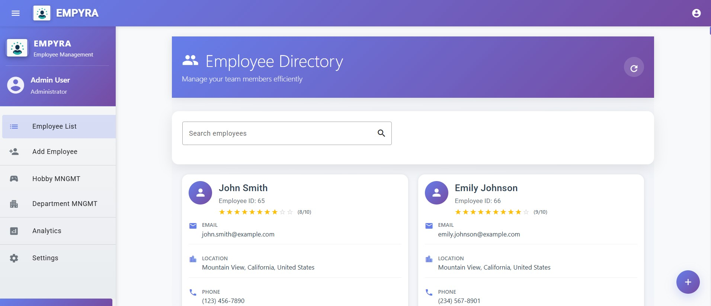
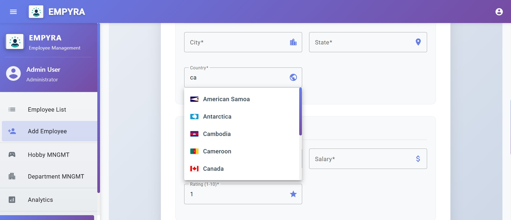
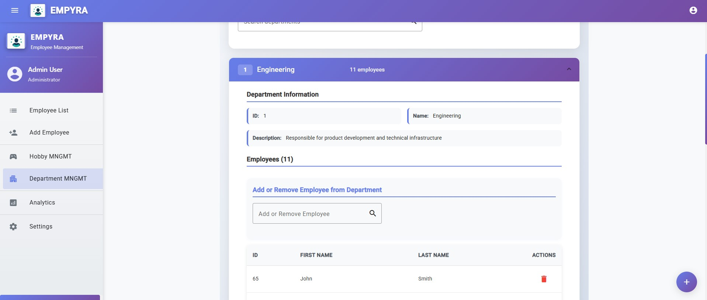
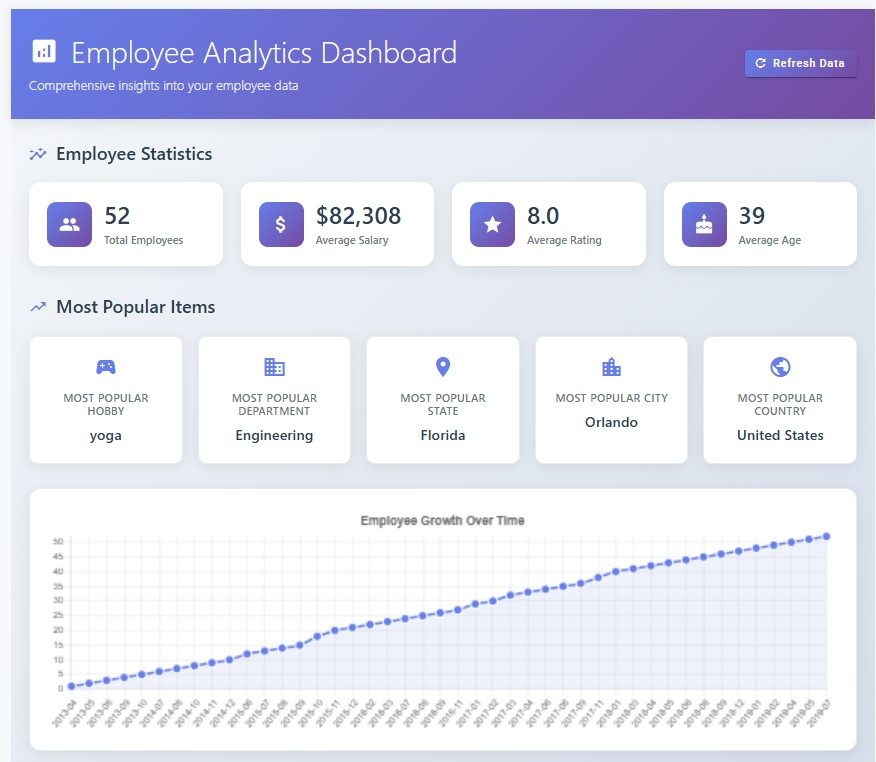
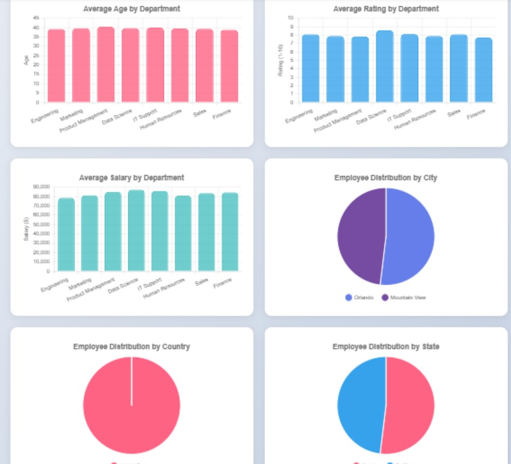
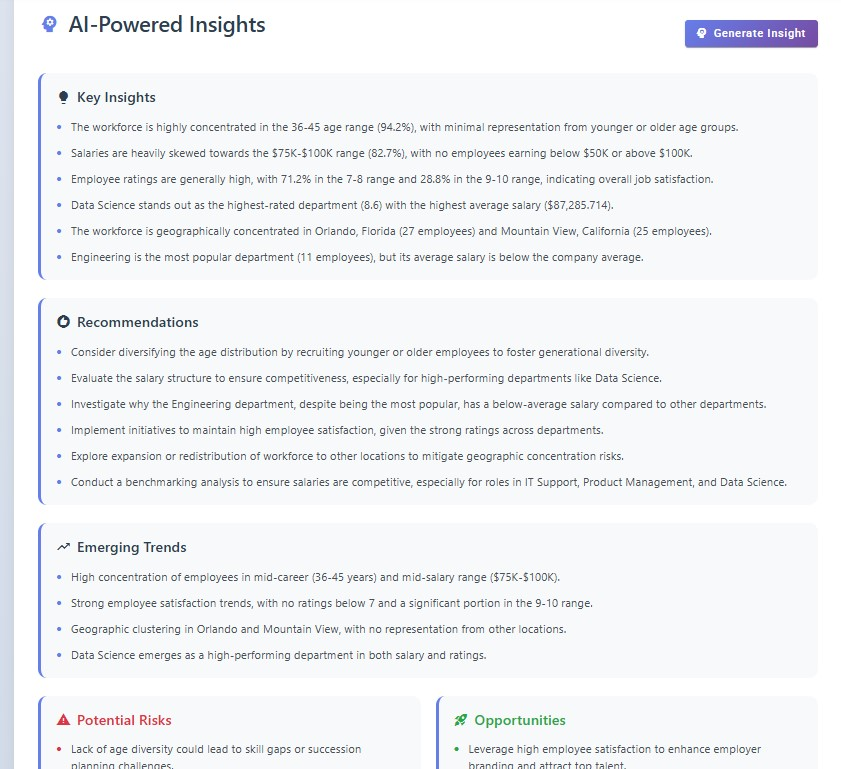
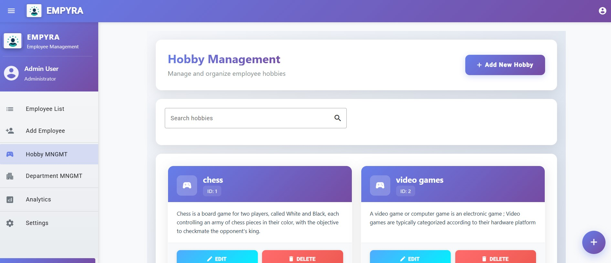

# EMPYRA - Employee Management System

<p align="center">
  
</p>

## Table of Contents
- [Project Overview](#project-overview)
- [Demo](#demo)
- [Features](#features)
- [Preview](#preview)
- [Setup Guide](#setup-guide)

## Project Overview

EMPYRA is a comprehensive Employee Management System built with Angular (using Material UI) for the frontend and Spring Boot for the backend, with MySQL as the database. The system leverages REST APIs to facilitate seamless communication between the frontend and backend components, with API documentation automatically generated using SwaggerUI.

To enhance user experience during employee data entry, EMPYRA integrates with the Restful Countries API, providing intelligent suggestions for country-related fields. The system also features advanced data visualization capabilities powered by Chart.js, presenting key metrics such as employee joining trends over time, department-wise average age and ratings, and geographical distribution of employees across cities, states, and countries.

The analytics module takes this a step further by feeding the visualized data to the OpenRouter API, which accesses DeepSeek V3 0324 to generate actionable insights. These AI-powered insights include key findings, strategic recommendations, emerging trends, and potential opportunities specific to your organizational data.

## Demo

[](https://github.com/user-attachments/assets/07a2af0f-962c-49a8-91d5-20abc10bd39e)

## Features

- **Intelligent Data Entry**: Country suggestions powered by Restful Countries API
- **Advanced Analytics**: 
  - Visualizations of employee demographics and performance metrics
  - AI-generated insights with DeepSeek V3 0324 via OpenRouter API
- **Responsive Dashboard**: Interactive charts and data visualizations
- **Secure API Integration**: Robust Spring Boot backend with documented REST endpoints

## Preview

### Employee Management
<p align="center">
  <br/>
  <em>Figure 1: Employee List View</em>
</p>

<p align="center">
  <br/>
  <em>Figure 2: Employee Creation Form</em>
</p>

### Department Management
<p align="center">
  <br/>
  <em>Figure 3: Department Management</em>
</p>

### Analytics Dashboard
<p align="center">
  <br/>
  <em>Figure 4: Analytics Dashboard - Overview</em>
</p>

<p align="center">
  <br/>
  <em>Figure 5: Analytics Dashboard - Department Metrics</em>
</p>

<p align="center">
  <br/>
  <em>Figure 6: Analytics Dashboard - Geographical Distribution</em>
</p>

### Additional Features
<p align="center">
  <br/>
  <em>Figure 7: Employee Hobbies Management</em>
</p>

## Setup Guide

To set up EMPYRA locally, follow these steps:

### Prerequisites

- Node.js (v16 or later)
- Angular CLI
- Java JDK (v11 or later)
- Maven
- MySQL

---

### 🔧 Backend Setup (Spring Boot)

```bash
# Clone the repository
git clone https://github.com/OnePieceReal/EMPYRA.git

# Navigate to the backend directory
cd EMPYRA/backend

# Install dependencies
mvn install
```
